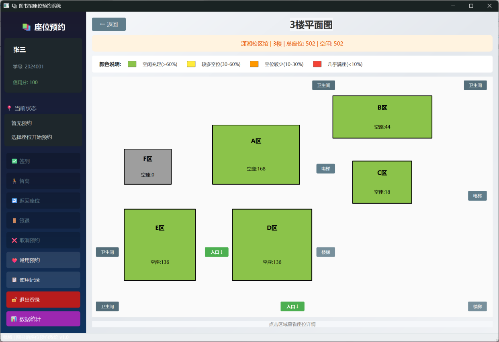
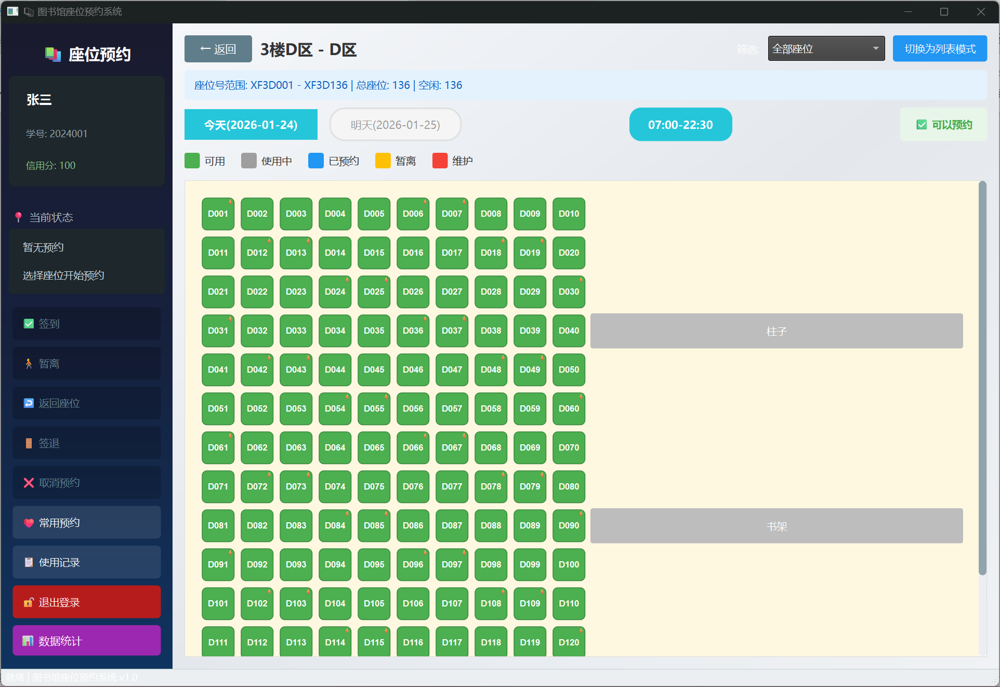
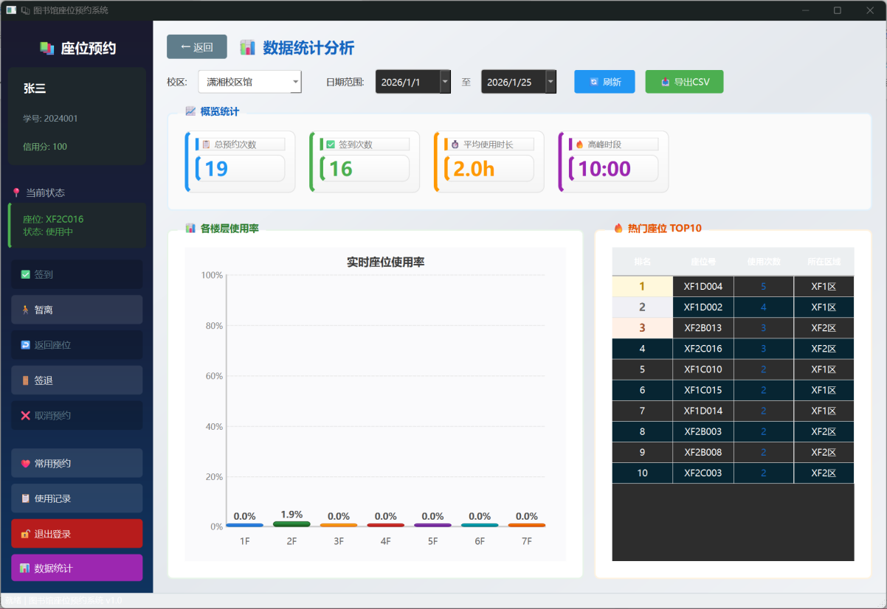
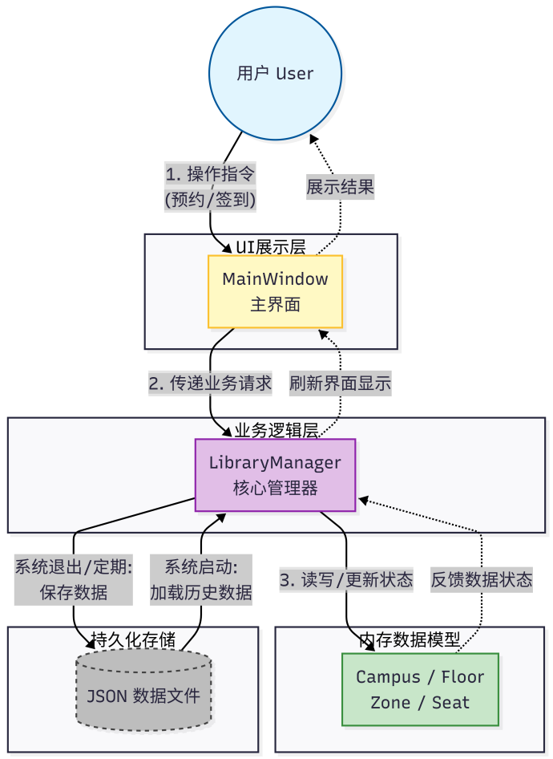
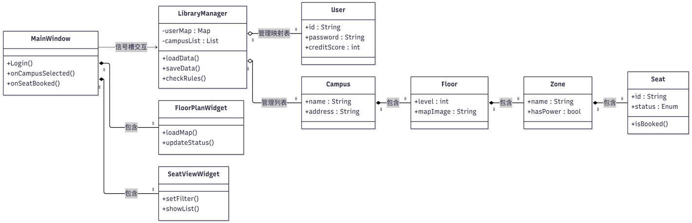

[English Version](./README_EN.md) | [中文文档](./README.md)
# 图书馆座位预约系统 (Library Seat Reservation System) v3.0

<table>
  <tr>
    <td width="33%"></td>
    <td width="33%"></td>
    <td width="33%"></td>
  </tr>
</table>

## 1. 系统概述 (System Overview)
本系统是一个基于 Qt/C++ 框架开发的图书馆座位预约管理系统，采用 MVC 架构模式设计。系统模拟了真实图书馆的座位分区查询、预约、签到/暂离/签退状态管理以及信用分系统。

## 2. 核心功能 (Key Features)
* **多校区支持**：支持潇湘、岳麓山、天心、杏林四个校区分馆，每个校区拥有独特的主题色。
* **可视化选座**：
    * **热力图模式**：区域颜色深浅动态反映空闲程度（绿色>60%空闲 → 红色<10%空闲）。
    * **双视图切换**：支持地图模式（模拟真实布局）和列表模式（高效筛选）。
* **完整的预约流程**：
    * 支持“当日”及“次日”双日期预约。
    * 包含签到（15分钟限制）、暂离（30分钟限制）、签退全流程闭环。
* **信用分体系**：初始 100 分，违规（如爽约、超时未归）扣分，正常使用加分。低于 70 分将限制预约。
* **智能特性**：无全局变量设计，使用 JSON 进行数据持久化（重启数据不丢失）。

## 3. 运行环境 (Environment)
* **操作系统**: Windows 10/11, macOS, Linux
* **开发框架**: Qt 5.15+ 或 Qt 6.x
* **编译器**: 支持 C++17 (MinGW, MSVC, GCC)

## 4. 安装与使用 (Installation)
1. 使用 Qt Creator 打开 `LibraryReservationSystem.pro`。
2. 选择构建套件 (Kit) 并点击“运行”。
3. **测试账号**：
    * 管理员：`admin` / `admin123`
    * 本科生：`2024001` / `123456`
    * 教师：`T001` / `123456`

## 5. 文档 (Documentation)
更详细的设计细节、架构说明及使用手册，请查看 [docs/图书馆座位预约系统_软件使用说明.pdf](docs/图书馆座位预约系统_软件使用说明.pdf)。

## 6. 界面预览 (Screenshots)

### 登录与注册

### 温馨提示

### 校区与楼层选择

### 楼层平面图

### 座位详情视图

### 数据统计与导出

## 7. 系统设计 (System Design)

### 业务流程图

### 数据流图

### 系统类图

